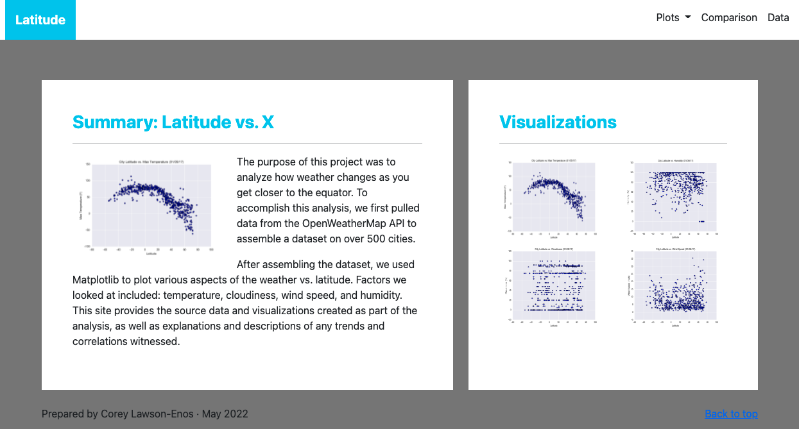

# Latitude vs. X: Web Visualization

Prepared by Corey Lawson-Enos

## Summary
* HTML webpages that compare geographical latitude's effect on four weather categories--Temperature, Humidity, Cloudiness, and Wind Speed. 
* Includes Northern/Southern hemisphere comparison, visualizations, and source data for inspection.

## Technologies
HTML, CSS, Bootstrap, Pandas

## URL

* https://clawson13.github.io/Web-Design-Challenge/

## Landing Preview

## Contact
E-mail: clawson131@gmail.com 
LinkedIn: https://www.linkedin.com/in/corey-lawson-enos/
